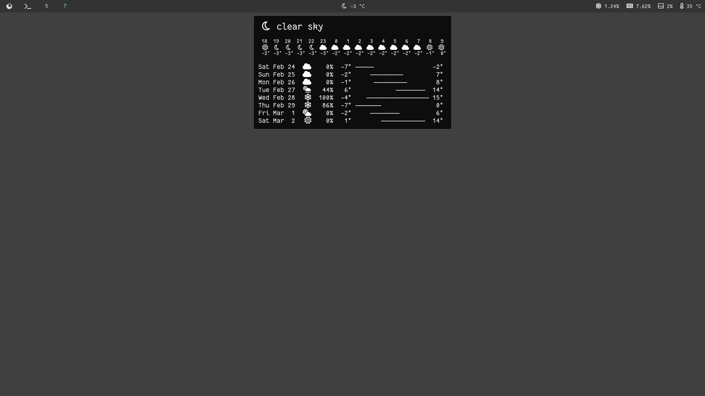
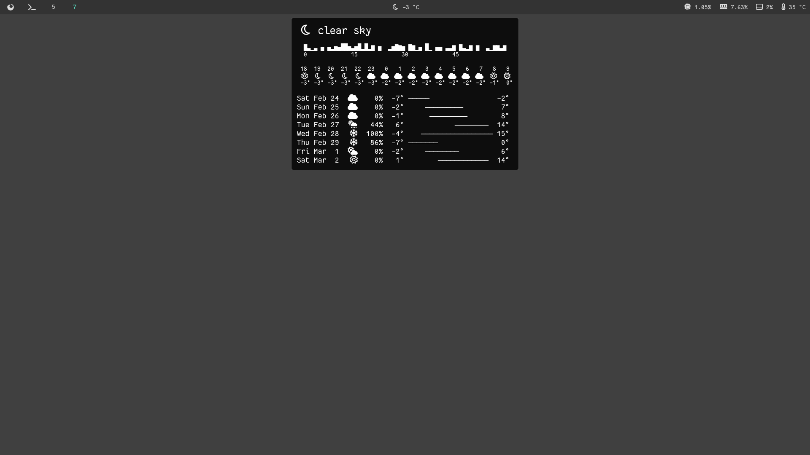

# waybar-weather
A weather module for Waybar.


Demonstration of weather module.


Demonstration of weather module showing precipitation chart for the next hour (simulated data).

## Requirements
This module uses Font Awesome 5 Free and Fantasque Sans Mono. Any monospace font should work in its place, though. Of course, it also requires you to be using Waybar.

## Installation
See ```module-config``` for an example of how to include the module into your Waybar config file. See ```style.css``` for the single required styling rule for your Waybar style file. You will need to edit ```weather.conf``` to add your latitude, longitude, choice of units (metric/standard/imperial), and an API key for OpenWeatherMap's OneCall 3.0 service (https://openweathermap.org), which this project uses as a data source. The service is free for up to 1,000 API calls per day.

## Features
* Live temperature and status icon shown in Waybar.
* Minutely precipitation chart shown for the next hour if there is any forecasted (otherwise not shown)
* Hourly temperatures and status icons for the next sixteen hours
* Daily status icons, probability of precipitation, and temperature graph for the next eight days
