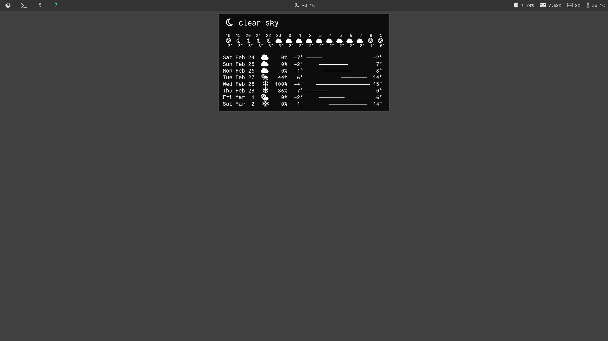
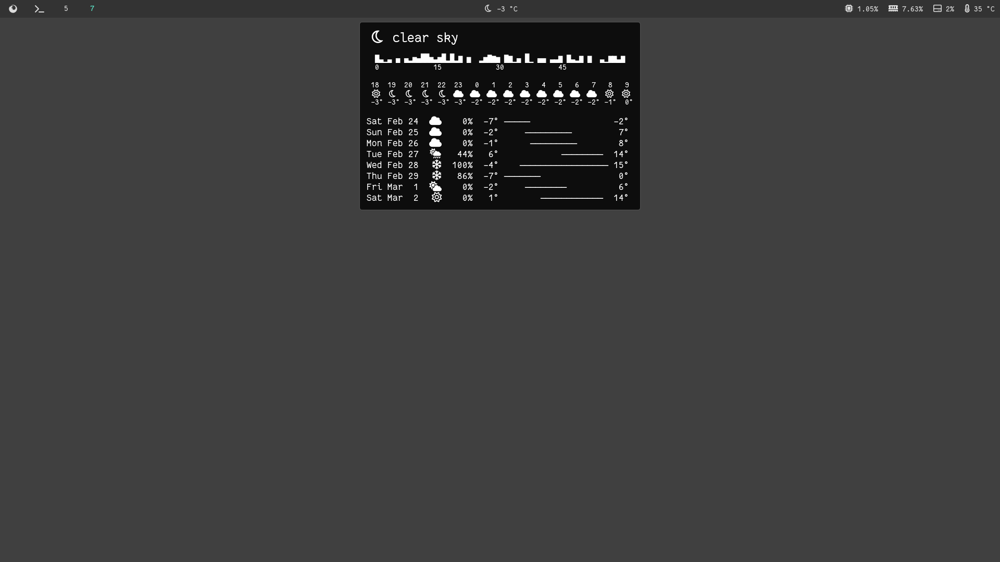

# waybar-weather
A weather module for Waybar.


Demonstration of weather module.


Demonstration of weather module showing precipitation chart for the next hour (simulated data).

## Requirements
This module uses "Font Awesome 5 Free" for the current weather icon and the daily chart icons, "JetBrainsMono Nerd Font Mono" for the hourly chart icons, and "Fantasque Sans Mono" for text. If you want to change the text font, be prepared to have to fine-tune the space paddings on the daily chart icons. Of course, it also requires you to be using Waybar. 

## Installation
```
cd ~/.config/waybar
git clone https://github.com/RiScJ/waybar-weather
```

See ```module-config``` for an example of how to include the module into your Waybar config file. 

See ```style.css``` for the single required styling rule for your Waybar style file. 

You will need to edit ```weather.conf``` to add your latitude, longitude, choice of units (metric/standard/imperial), and a choice of backend data provider (owm/meteo). 

If you choose ```owm``` (OpenWeatherMap), an API key for their OneCall 3.0 service (https://openweathermap.org) is required. The service requires you to provide billing information, but it is free to use for up to 1,000 API calls per day. Provide the API key on the ```appid``` configuration key line. If you choose ```meteo``` (Open-Meteo), this line is ignored as no API key is required.

## Updating
```
cd ~/.config/waybar/waybar-weather
git pull origin master
```

## Features
* Live temperature and status icon shown in Waybar.
* Minutely precipitation chart shown for the next hour if there is any forecasted (only available with OWM backend)
* Hourly temperatures and status icons for the next sixteen hours
* Daily status icons, probability of precipitation, and temperature graph for the next eight days
